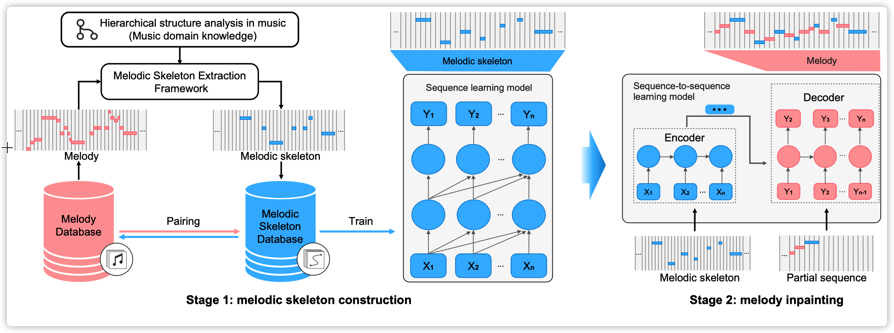

# WuYun

**We are working on refining the music generation project, including code, comments, and documentation**

Authors: Kejun Zhang†, Xinda Wu†, Tieyao Zhang, Zhijie Huang, Xu Tan, Qihao Liang, Songruoyao Wu, Lingyun Sun*

Paper | Blog | [Audio demo (Zendo) ](https://doi.org/10.5281/zenodo.7480956) | Online interactive system

WuYun, is  a knowledge-enhanced deep learning architecture for improving the structure of generated melodies. Inspired by the hierarchical organization principle of structure and prolongation, we decompose the melody generation process into melodic skeleton construction and melody inpainting stages, which first generate the most structurally important notes to construct a melodic skeleton and subsequently infill it with dynamically decorative notes into a full-fledged melody. Specifically, we introduce a melodic skeleton extraction framework from rhythm and pitch dimensions based on music domain knowledge to help the sequence learning model hallucinate or predict a novel melodic skeleton. The reconstructed melodic skeletons serve as additional knowledge to provide auxiliary guidance for the melody generation process and are saved as the underlying framework of the final generated melody.

<p align="center"><br/>Architecture of WuYun. </p>


## 1. Data

We obtain Wikifonia dataset from [here](http://www.synthzone.com/files/Wikifonia/Wikifonia.zip) and transfer them to be the MIDI format. We provide Wikifomia dataset in the MIDI format on [Zenodo](https://doi.org/10.5281/zenodo.7480956).


## 2. Dependency (Ours)

- Python: v3.8

- Pytorch: v1.7.1

- GPU: NVIDIA GTX 2080-Ti GPU 

  Note: There are no specific requirements for software versions. We will release more details about the dependencies we use.


## 3. Data Processing Framework

For music generation task, data quality is very important for model training. However, there is a lot of noise in the online symbolic music data, so we set up a symbolic music processing framework for symbolic music understanding and generation tasks. Here, we release many of the core symbolic music processing features, including beat filtering, MIDI quantization (straight notes and triplets), melody skeleton extraction, tension distance calculation, deduplication, and more. Some functions are reproduced or merged from paper and open-sources codes. We will acknowledge their contributions at the bottom of this page.

- **Core functions**
  - Track Classification ([midi-miner](https://github.com/ruiguo-bio/midi-miner)): lead melody, chord, bass, drum, and others.
  - MIDI Quantization (straight notes and triplets) (WuYun)
  - Total tension calculation ([midi-miner](https://github.com/ruiguo-bio/midi-miner))
  - Rhythmic skeleton extracton  (WuYun)
  - Tonal skeleton extraction  (WuYun)
  - Deduplication ([MusicBert](https://github.com/microsoft/muzic))
  - Chord Recognition (Magenta)
  - Tonality Unification (WuYun)
  - Octave Transposition (Normal function)
  - ...

​	Note: There are a lot of customized parameters for you to adjust the results you want. Therefor, the final output of the number of files may be different from the number in the paper. Our common goal is to obtain better training data for music understanding and generation tasks. If you find better parameters, please feel free to contact us.

- Run the dataset processing script for WuYun. (`prepare_exp1_wikifornia.py`)

  ```python
  python3 mdp/data_gen/paper_wuyun/prepare_exp1_wikifornia.py
  ```


## 4. Training

```bash
cd wuyun/01_skeleton
export PYTHONPATH=.
```

### 4.1 build dictiory
Please configure your dictionary save path `binary_data_dir` in `configs/exp01_skeleton_wikifonia.yaml`
```bash
python3 ./paper_tasks/dataset/build_dictionary.py --config configs/exp01_skeleton_wikifonia.yaml
```

### 4.2 corpus2events
Please cofigure your paths in `configs/exp01_skeleton_wikifonia.yaml`:  
- save path: `binary_data_noChord_path`
- Training dataset: `raw_skeleton_data_dir_train`
- Test dataset: `raw_skeleton_data_dir_test`

```bash
python3 ./paper_tasks/dataset/corpus_compile.py --config configs/exp01_skeleton_wikifonia.yaml
```

### 4.3 training model
Please cofigure your device and model configuration in `paper_tasks/TransforXL_Small_noChord.yaml`

```bash
python3 ./paper_tasks/model/train_pytorch_small_noChord.py --config configs/exp01_skeleton_wikifonia.yaml

```

### 4.4 inference
Please cofigure your checkpoint path `exp_order` in `paper_tasks/inference_withPrompt_small_noChord.py`

```bash
python3 ./paper_tasks/model/inference_withPrompt_small_noChord.py --config configs/exp01_skeleton_wikifonia.yaml
```


## 5. Acknowledege

